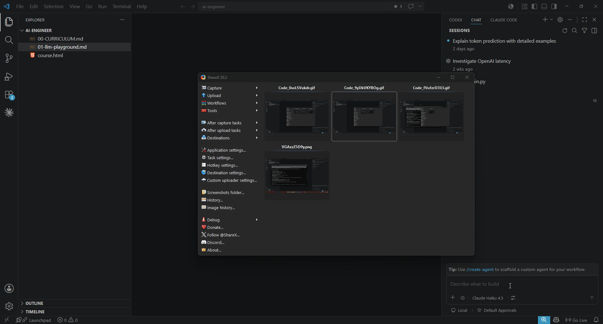

# VoiceFlow

[](https://github.com/apgodlike/voiceflow/actions/workflows/ci.yml)
[](https://github.com/apgodlike/voiceflow/releases/latest)
[](LICENSE)

**Free, private, offline voice typing for Windows.**
Hold **Ctrl + Alt**, talk, release — clean text lands at your cursor, in any app.

No subscription. No account. No API key. **Your voice never leaves your PC.**



## Why VoiceFlow

- 🎙️ **Type with your voice anywhere** — email, chat, code editor, browser. If you can type in it, you can talk to it.
- 🔒 **100% local & private** — local mode runs [Whisper](https://github.com/SYSTRAN/faster-whisper) on your own machine. No cloud, no account, **zero network calls**. Audio is deleted right after it's typed.
- 💸 **Free forever** — open source (MIT). No subscription, no per-word billing. Wispr Flow is $14/month; VoiceFlow is $0.
- ⚡ **Fast, and flat** — because it transcribes *while you speak*, text appears a few seconds after you release — **and that stays the same whether you talked for 5 seconds or 5 minutes.**
- 🧹 **Clean output** — strips "um / uh / you know", auto-capitalizes and punctuates, fixes your jargon with a custom dictionary.
- ☁️ **Or use the cloud** — prefer OpenAI's API? Paste a key and get near-instant results. Your choice, switch anytime.

## Install

**Option A — Scoop** (no SmartScreen prompt, auto-updates):

```powershell
scoop bucket add voiceflow https://github.com/apgodlike/voiceflow
scoop install voiceflow
```

Scoop verifies the download by SHA-256, so there's no "Unknown publisher" warning. No Scoop yet? `irm get.scoop.sh | iex`. Update later with `scoop update voiceflow`.

**Option B — PowerShell one-liner:**

```powershell
irm https://raw.githubusercontent.com/apgodlike/voiceflow/main/install.ps1 | iex
```

Downloads the latest release and launches the installer.

**Option C — Manual:** grab **`VoiceFlow-Setup.exe`** or the portable **`VoiceFlow-portable-*.zip`** from the [Releases page](https://github.com/apgodlike/voiceflow/releases) and run it.

> **SmartScreen note** — the installer is currently unsigned, so Windows shows "Windows protected your PC". Click **More info → Run anyway**. Scoop (Option A) skips this entirely. Code signing is planned; the source is fully auditable here.

### First launch

A short wizard opens — pick one:

- **Local — Whisper** (recommended): no key, no cost, fully offline. Pick a model and it downloads once (145 MB–1.5 GB). Done.
- **Cloud — OpenAI**: paste your API key ([how to get one](docs/getting-an-openai-api-key.md)). Faster, costs a few cents per session.

Then just hold **Ctrl + Alt** and talk. Switch modes anytime from the tray menu.

## Speed

VoiceFlow transcribes in chunks *while you speak*, so on release only the last few seconds are left to process. **The wait is flat — independent of how long you dictated.**

On a typical modern multi-core laptop, local mode with the default model returns in **~3–4 seconds**, the same for a 10-second note or a 5-minute monologue. Exact speed depends on your CPU and chosen model (older / low-core machines are slower; cloud mode is faster still).

## Local models

Choose in the first-run wizard or Settings. English-only models are faster *and* more accurate for English; "distil" models are distilled for extra speed.

| Model | Best for | Speed* | Download |
|-------|----------|--------|----------|
| **distil-medium.en** | **Recommended** — English, fast + accurate | ~3–4 s | 790 MB |
| distil-small.en | Older / low-core PCs, max speed | ~2 s | 330 MB |
| distil-large-v3 | Highest accuracy (slow on CPU) | ~15–20 s | 1.5 GB |
| small / medium | Other languages (multilingual) | ~3–6 s | 485 MB / 1.5 GB |

<sub>*Flat post-release wait on a 6-core CPU; scales with your hardware. Models download once and run offline forever after.</sub>

> On a CPU (no GPU), Whisper *large* models have a fixed ~12.5 s cost per call — great accuracy, but not real-time. **`distil-medium.en` is the sweet spot for everyday dictation.**

## VoiceFlow vs Wispr Flow

| | VoiceFlow | Wispr Flow |
|---|---|---|
| Price | **Free** | $14/month |
| Source | **Open source (MIT)** | Closed |
| Works offline | **Yes — fully local, no account** | Paid tier |
| Privacy | **Audio never leaves your PC** (local mode) | Cloud |
| Platform | Windows | Mac + Windows |
| Transcription | Local Whisper **or** OpenAI API | Proprietary cloud |

## Features

- **Works in any app** — pastes at your cursor, no integration needed
- **Local or cloud** — offline Whisper (no key) or OpenAI API, toggle live from the tray
- **Flat latency** — transcribes during recording; result lands seconds after you release, any length
- **Smart cleaning** — strips fillers, auto-capitalizes sentences, optional spoken punctuation
- **Custom dictionary** — fix recurring mistranscriptions (names, jargon) deterministically
- **Animated overlay** — audio-reactive waveform while recording
- **Paste or type** — Ctrl+V (default) or character-by-character for apps that block paste
- **Paste Previous**, **mic picker**, **language hint**, **start on login**
- **Privacy-first** — audio deleted after paste, no transcript storage, no telemetry

## Hotkey

Both modes use **Left Ctrl + Left Alt**:

| Mode | Gesture | Behavior |
|------|---------|----------|
| **Hold** | Press and hold | Recording starts after 200 ms; release → stops |
| **Toggle** | Double-tap (two down+up cycles within 400 ms) | Recording stays on; next tap stops |

Recording auto-stops at 10 minutes (configurable). A toast notifies you to start again.

## Settings

Open from the tray (**Settings…**) or the main window.

| Tab | Configure |
|-----|-----------|
| **API** | Backend (Local Whisper / OpenAI): local model download & remove, or OpenAI key + cloud model |
| **Recording** | Input device (mic picker), language hint |
| **Behavior** | Paste method, voice commands, code mode, raw mode, preserve clipboard |
| **Text** | Extra fillers to strip, custom dictionary (spoken word → replacement) |

Saved to `%LOCALAPPDATA%\VoiceFlow\config.json`.

## Text cleaning

By default VoiceFlow:
- Strips fillers: `uh um er ah you know i mean basically`, trailing `right`, leading `so`
- Strips `like` only after a to-be verb ("I was like going" → "I was going"; "I like coffee" → unchanged)
- Capitalizes the first letter and each sentence start; appends a period if missing

**Opt-in modes** (Settings → Behavior or `config.json`):

| Mode | Effect |
|------|--------|
| `voice_commands` | "comma" / "period" / "new line" / "new paragraph" → literal symbols |
| `code_mode` | No auto-capitalize, no trailing period |
| `raw_mode` | Verbatim transcript — bypass all cleaning |

**Custom dictionary** (Settings → Text):
```json
{ "cloud": "Claude", "open ai": "OpenAI" }
```
Longest match wins, case-insensitive, replacement inserted verbatim.

## Privacy

- **Local mode makes zero network calls** — audio is transcribed entirely on your machine.
- **No transcript storage.** Text is pasted and forgotten.
- **Audio lifecycle:** recorded → transcribed → deleted. Kept only if transcription fails (for retry), then deleted after max attempts.
- **Logs:** `voiceflow.log` — timing and file counts only, never transcript content.
- **No telemetry.** In cloud mode the *only* outbound call is audio → OpenAI; in local mode there are none.
- **API key** (cloud mode) stored locally in `config.json`, never leaves your machine except in the OpenAI API header.

## Quick start (from source)

**Requirements:** Python 3.11+, Windows 11.

```powershell
cd voiceflow
python -m venv venv
venv\Scripts\activate
pip install -r requirements.txt
python -m voiceflow.main
```

The first-run wizard sets up local or cloud mode. (For cloud, you can also add `OPENAI_API_KEY=sk-...` to a `.env` file.)

## Configuration reference

`%LOCALAPPDATA%\VoiceFlow\config.json` — edit directly or use Settings:

| Key | Default | Description |
|-----|---------|-------------|
| `backend` | `"openai"` | `"local"` (offline Whisper) or `"openai"` (cloud) |
| `local_model` | `"distil-medium.en"` | Local Whisper model (see table above) |
| `openai_api_key` | `""` | API key for cloud mode (fallback: `OPENAI_API_KEY` env var) |
| `model` | `gpt-4o-mini-transcribe` | Cloud transcription model |
| `language` | `""` | ISO-639-1 hint, e.g. `"en"`, `"hi"` — blank = auto |
| `paste_mode` | `"clipboard"` | `"clipboard"` or `"type"` |
| `preserve_clipboard` | `false` | Restore prior clipboard after paste |
| `max_recording_sec` | `600` | Auto-stop cap in seconds; `0` = no cap |
| `voice_commands` | `false` | Spoken punctuation commands |
| `code_mode` | `false` | No auto-cap / no trailing period |
| `raw_mode` | `false` | Verbatim transcript |
| `dictionary` | `{}` | `{"spoken": "Replacement"}` map |
| `extra_fillers` | `[]` | Extra words to strip |
| `input_device` | `null` | Device index from `sounddevice.query_devices()` |
| `notifications_enabled` | `true` | Show paste toasts |
| `start_on_login` | `true` | Launch at Windows sign-in |

Environment overrides: `OPENAI_API_KEY`, `VOICEFLOW_MODEL`, `VOICEFLOW_DATA_DIR`.

## Building from source

```powershell
cd voiceflow
venv\Scripts\activate
pip install -r requirements-dev.txt

pyinstaller VoiceFlow.spec --noconfirm   # → dist\VoiceFlow\VoiceFlow.exe
ISCC installer.iss                       # → dist\VoiceFlow-Setup.exe  (needs Inno Setup)
```

> **Always test on a machine without Python.** Missing native DLLs (PortAudio, libsndfile) only surface on a clean machine.

## Architecture

```
hotkey.py ──── on_start / on_stop
                    │
                    ▼
             recorder.py ─── chunks (cut on silence) ──► transcriber (local Whisper or OpenAI)
                    │                                          │ stitch on stop
                    │ full OGG (durable)                       ▼
                    ▼                                    cleaner.py
              queue.py ◄── enqueue ◄── fallback ◄──────      │
                    │  (sweeper retries on failure)           ▼
                    └──────────────────────────────►  paster.py ──► cursor
```

- **Chunks transcribed during recording** → only the final chunk is left on release (flat latency). Chunk size is tuned per backend/model.
- Full OGG is the durable retry/privacy unit; chunks are ephemeral, always deleted.
- Queue writes are atomic (`os.replace`); crash-safe.

See [docs/ROADMAP.md](docs/ROADMAP.md) for what's next.
